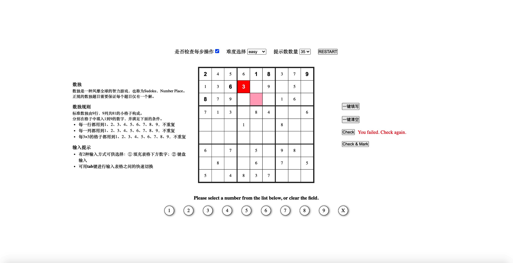

# sodukuGame
a sodukuGame developed by Jenny Lin

## 效果图

## 所用技术
原生JS，不使用任何技术框架

## 待完成功能
1. 倒计时：可设置完成时间，显示倒计时时间，时间一到，弹窗提示；
2. 统计完成时间：正计时，并显示正计时时间；
3. 限制检查输入数字是否正确的次数；
4. 性能优化：不需要更新的结点不进行更新，需要更新的结点一次性进行更新，避免多次回流、重绘；
